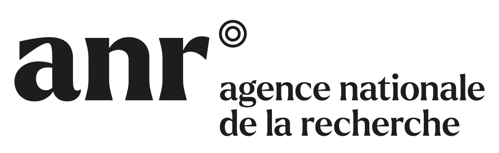

::: {.callout-note appearance="simple"}
### Work in Progress

This page is still under construction.

:::

This page provides additional details about [ANR](), the funding agency making this project possible, as well the different partners involved in **BENEFIT**.

## Agence Nationale de la Recherche (ANR)

::: {.grid}

::: {.g-col-4}

:::

::: {.g-col-8}
The [**Agence Nationale de la Recherche**](https://anr.fr/) (ANR) is a French institution founded in February 2005.
It is tasked with funding the French scientific research activities, both public and partners-based.
:::

:::

It does so through a competitive call for project every year. Accepted projects are typically funded for a duration of three to four years. In 2021, 23% of the submitted projects were funded in the end, for a total budget of nearly 900 M€.
The project **BENEFIT**, accepted during the 2025 call for project, is funded through the particular program [*???*]().

## DynFluid Laboratory

::: {.grid}

::: {.g-col-4}

:::

::: {.g-col-8}
[**DynFluid**](https://dynfluid.ensam.eu/) is an Academic research laboratory specialized in computational fluid dynamics located on the parisian campus of **Arts et Métiers Institute of Technology**.
:::

:::

Along with researchers from **Arts et Métiers Institute of Technology**, **DynFluid** also hosts two colleagues from the [**Conservatoire National des Arts et Métiers**](https://www.cnam.fr/) (CNAM).
Members of **DynFluid** have a worlwide recognized expertise in high-performance computing for compressible turbulent flows, the development of uncertainty quantification techniques for industrial turbulence models, as well as for their studies of the hydrodynamic instabilities and physical mechanisms underpinning the transition to turbulence.
