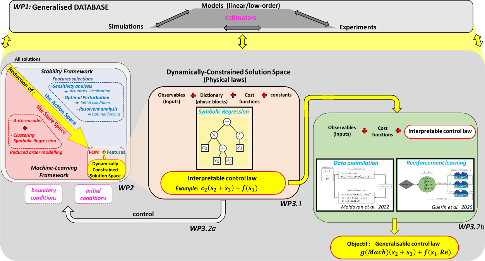

::: {.callout-note appearance="simple"}
### Work in Progress

This page is still under construction.

:::

## The Project

The project **BENEFIT** is funded by the [Agence Nationale pour la Recherche (ANR)](https://anr.fr/en/anrs-role-in-research/about-us/missions/) through the grant agreement ANR-??-????-????.
It started in March 2026 and will last for four years (until the end of December 2029).
It proposes a novel framework that synegistically integrates *model-driven* stability analysis with *data-driven* machine learning techniques to design interpretable control strategies for fluid flows.
Current approaches to flow control face significant limitations: stability-based methods provide valuable insights but are inherently limited in capturing the nonlinear dynamics essential for practical control applications, whilst data-driven approaches often confront difficulties with the high-dimensional and multi-scale characteristics inherent in turbulent flows.

This research aims to develop a comprehensive framework for designing active flow control strategies that harness inherent flow instabilities through the coupling of model-driven data data-driven methods.
The central hypothesis is that by exploiting the natural instabilities and strategically influencing their dynamics, it is possible to optimise specific quantities such as friction, heat transfer or other relevant parameters with minimal energy input.
This approach offers particular advantages where maintaining control effectiveness at high flow velocities can become energy-intensive.
Although the framework accomodates various active actuators, plasma actuators form the focus of the current project.
Despite their versatility in enabling sophisticated spatio-temporal control strategies, plasma actuators have seen limited adoption in real-world applications due to the relatively modest magnitude of perturbations they generate.
The proposed framework addresses this limitation by specifically targeting flow instabilities, where even small perturbations can trigger significant flow modifications.

## Team members

### IUSTI

- **Lionel Larchevêque** (Maître de conférence) is member of the supersonic group of the IUSTI laboratory. His research focues on high-fidelity simulations of compressible flows complementing experimental database in view of advanced joint-analyses of the dynamics of separated flows.

- **Stéphane Piponniau** (Maître de conférence) is a specialist in compressible flows and experimental methods applied to high-speed flows. He is responsible for the *Supersonic Wind Tunnel* at IUSTI which has has been designated as the *compressible flows* research platform at Aix-Marseille University. His research focuses on the identification of turbulent structures through modal decompositions, conditional approaches and stochastic estimations.

- **Pierre Dupont** (Chargé de Recherche) is a specialist in compressible flow. He was Deputy Director of IUSTI from 2018 to 2022, scientific lead for IUSTI's contributions in three European programs and coordinates the ANR DECOMOS (2010-2014). He is also responsible for research programs in collaboration with CNES and has been a member of the steering committee for establishing a CNRS network on large-scale experimental facilities (Réseau RAMSES).

### Institut Pprime

- **Lionel Agostini** (Chargé de Recherche) has significant expertise in wall-bounded turbulent flows, drag reduction strategies, and machine learning applications for fluid dynamics. His research on autoencoder technologies for dimensional reduction and reinforcement learning approaches for flow control has demonstrated promising results in recent studies. His work on data-driven modeling approaches will be valuable for the project, in particular in developing interpretable reduced-order models balancing computational efficiency with physical consistency.

- **Philippe Traoré** (Professeur des Universités) is a specialist in numerical methods for complex flows and has developed the in-house code ORACLE3D for fluid mechanics simulations with plasma actuators. His experise in control strategies and numerical modelling wil support multiple aspects of the research program.

- **Laurent Cordier** (Directeur de Recherche) brings critical expertise in dimensional reduction techniques, data-driven modelling and data assimilation. His experience with reduced-order models and flow control will be particularly valuable in this project.

- **Julien Sablon** (Maître de Conférences) has obtained his PhD from ISAE Toulouse in 2023. He specializes in linear stability analysis and vortex dynamics.

### DynFluid

- **Jean-Christophe Robinet** (Professeur des Universités) is the head of the DynFluid laboratory. He is an expert in compressible flows in the field of aeronautics and aeorospace. He is a recognized specialist in the development of methods and the study of instabilities and transition to turbulence.

- **Jean-Christophe Loiseau** (Maître de conférence) is a specialist in numerical linear algebra, optimal control and reduced-order modeling. His research activities focus on elucidating the physical mechanisms responsible for transition to turbulence in fully three-dimensional flows, and the development and use of data-driven techniques for reduced-order modeling in the physical and engineering sciences.

- **Nicolas Alferez** (Maître de conférence) is a specialist in compressible flows and high-performance computing. He is the main developer of the `dNami` code, an open-source multi-language framework for solving systems of balance laws using explicit numerical schemes on structured meshes, in particular for instability problems in compressible regimes thanks to automatic differentiation methods.
